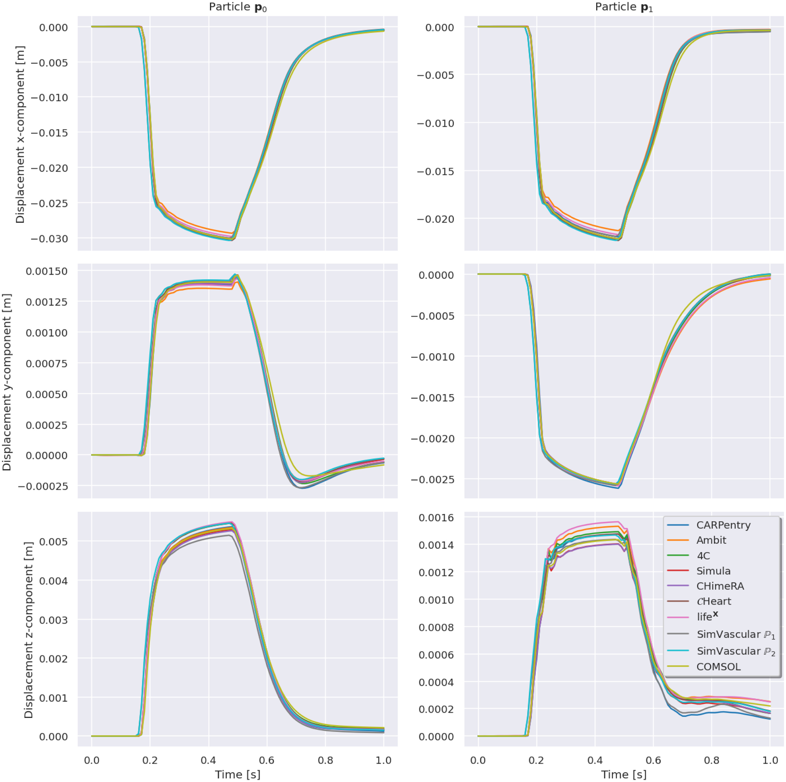

This test case simulates an idealized left ventricle with a Holzapfel-Ogden material model
contracting due to time-dependent active stress, and subject to a time-dependent
pressure load on the endocardial surfaces. The problem set up can be found in
Problem 1A of a cardiac elastodynamcis benchmark paper (Aróstica et al., 2025)[1]. A comparison of the displacement of two throughout the cardiac cycle obtained from multiple solvers, including SimVascular is shown below:

Aditionally, we can plot a pressure-volume loop of the idealied left vetnricle. Note that the time-dependent pressure load in this problem is not supposed to be physiologically accurate.

[1]: Reidmen Aróstica, David Nolte, Aaron Brown, Amadeus Gebauer, Elias Karabelas, Javiera Jilberto, Matteo Salvador, Michele Bucelli, Roberto Piersanti, Kasra Osouli, Christoph Augustin, Henrik Finsberg, Lei Shi, Marc Hirschvogel, Martin Pfaller, Pasquale Claudio Africa, Matthias Gsell, Alison Marsden, David Nordsletten, Francesco Regazzoni, Gernot Plank, Joakim Sundnes, Luca Dede’, Mathias Peirlinck, Vijay Vedula, Wolfgang Wall, Cristóbal Bertoglio,
A software benchmark for cardiac elastodynamics,
Computer Methods in Applied Mechanics and Engineering,
Volume 435,
2025,
117485,
ISSN 0045-7825,
https://doi.org/10.1016/j.cma.2024.117485.